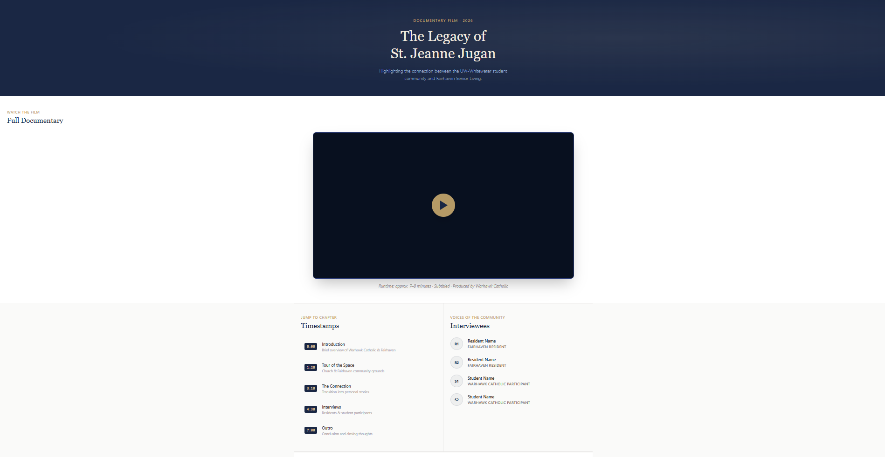
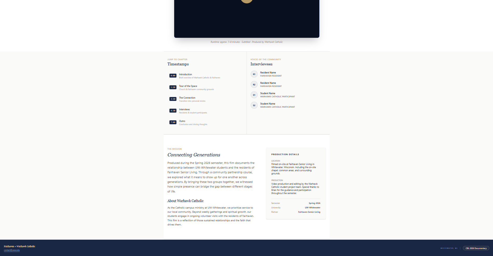

# Fairhaven Documentary Project
**Warhawk Catholic × Fairhaven Senior Living**

A single-page React application built to host and navigate the "Legacy of St. Jeanne Jugan" documentary. This project highlights the intergenerational connection between UW-Whitewater students and the residents of Fairhaven.

## 🛠 Tech Stack
* **Framework:** [Vite](https://vitejs.dev/) + [React](https://react.dev/)
* **Styling:** [Tailwind CSS](https://tailwindcss.com/)
* **Deployment:** Vercel (or preferred static hosting)

## Quick Start
To run this project locally, make sure you have [Node.js](https://nodejs.org/) installed.

1. **Clone & Install**
   ```bash
   git clone <your-repo-url>
   cd fairhaven-catholic
   npm install

2. ** Run & Build**
   ```bash
   npm run dev

   *optional final build*
   npm run build
   npm run preview


